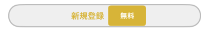

# RoundedUI

Configure rounded corners UI components on your Interface Builder .

In mobile projects there is a type of view/button which we has to deal usually. We can call it a rounded button/view because of its attributes. The following is common attributes for view:  

1. Rounded totally that looks like a circle, or with a custom corner radius.
2. Has border with border color and border width.
3. May or may not has shadow.  

A rounded button has the same above attributes with rounded view but with some additional attributes specificially for button:  

1. Has no background image, use color instead.
2. Is composite (is created by combine many button together).

   
An example of rounded button

Unfortunately Apple does support for access directly as well as modify attributes interface builder. Developer has to manually write code which is bored and tired. Because of that, this framework was created to provide support for these attributes conveniently and easily, and also be reusable in other projects.

## Requirements
- iOS 9.0+

## Install cocoapod spec repo
Before running example or install, please run command:  
```ruby
pod repo
```
In order to check whether the cocoapod spec with the following url has been installed or not:  
```ruby
https://bsvframeworks@bitbucket.org/bravesoftvietnam/cocoapods-specs.git
```
If not, run the following command:  
```ruby
pod repo add bsv_frameworks https://bsvframeworks@bitbucket.org/bravesoftvietnam/cocoapods-specs.git
```
## Example

To run the example project, clone the repo, and run `pod install` from the Example directory first.

If encounter error `[!] Unable to find a specification ...` upon running `pod install` then perform step **Install cocoapod spec repo** above.
After that rerun command `pod install`

## Installation

RoundedUI is available through [CocoaPods](https://cocoapods.org). To install it, first the beginning add the following border to your Podfile:  
```ruby
source 'https://github.com/CocoaPods/Specs.git'
source 'https://bsvframeworks@bitbucket.org/bravesoftvietnam/cocoapods-specs.git'
```  
then add:  
```ruby
pod 'RoundedUI','~> 1.0.0'
```
After that make sure this line is not commented:  
```ruby
use_frameworks!
```
If encounter error `[!] Unable to find a specification ...` upon running `pod install` then perform step **Install cocoapod spec repo** above.  
After that rerun command `pod install`

## Usage

### How to create  
#### Programatically
```swift
let view = RoundedView()
```
```swift
let button = RoundedButton()
```

#### Storyboard and XIB
1. Drap and drop a new UIButton or UIView.
2. Set the class of the UIButton to RoundedButton or UIView to RoundedView (note: you can set the class of UIView to RoundedButton too).
3. Set rounded configs for RoundedButton or RoundedView, or other parameters you want.

Here is a clip demonstrate the configurations:
https://drive.google.com/file/d/1sAkDJGXIr0xWwuFAdjmtl0CsprAqkHfI/view?usp=sharing 

### Configurable properties (in code and in Interface Builder)
Because UIView doesn't have highlighted, selected and disable state like UIButton. So there will be some different between these classes.
#### Fill color
##### RoundedButton
1. `fillColorNormal`: Fill color for normal state. Default `UIColor.clearColor()`
2. `fillColorHighlighted`: Fill color for highlighted state. Default is `fillColorNormal` with darker tone.
3. `fillColorSelected`: Fill color for selected state. Default is `UIColor.clearColor()`.
4. `fillColorDisabled`: Fill color for disabled state. Default is `UIColor.clearColor()`.

##### RoundedView
`fillColor`: Fill color. Default is clear `UIColor.clearColor()`.

#### Border Color
##### RoundedButton
1. `strokeColorNormal`: Border color for normal state. Default `UIColor.clearColor()`
2. `strokeColorHighlighted`: Border color for highlighted state. Default is `strokeColorNormal` with darker tone.
3. `strokeColorSelected`: Border color for selected state. Default is `UIColor.clearColor()`.
4. `strokeColorDisabled`: Border color for disabled state. Default is `UIColor.clearColor()`.

##### RoundedView
`strokeColor`: Border color. Default `UIColor.clearColor()`

#### Border width
`borderWidth`: Border stroke width. Default is `0`.

#### Rounded corners
1. `cornerRadius`: Rounded corner radius. Default is `0`.
2. `isCircle`: Try to round as circle. If `true`, `cornerRadius` will be ignore..

#### Highlight (only for RoundedButton)
`highlightedEnabled`: Enable highlight state when is clicked. If `YES` (or `true`), the button is highlighted when clicked, else the button is not highlighted.

#### Composite (only for RoundedButton)
`components`: Set child components in order to config composite buttons. Default is empty.

#### Shadow
**Note**: When config shadow please make sure `clipsToBound` is turned off or shadow will not be visible  

1. `shadowColor`: The color of the layer’s shadow.  
The default value of this property is an opaque black color.
2. `shadowRadius`: The blur radius (in points) used to render the layer’s shadow.  
You specify the radius The default value of this property is 3.0.
3. `shadowOffset`: The offset (in points) of the layer’s shadow.  
The default value of this property is (0.0, -3.0).
4. `shadowOpacity`: The opacity of the layer’s shadow.  
The value in this property must be in the range 0.0 (transparent) to 1.0 (opaque). The default value of this property is 0.0.

## Author

Hien, hienpham@bravesoft.com.vn

## License

RoundedUI is available under the APACHE license. See the LICENSE file for more info.
